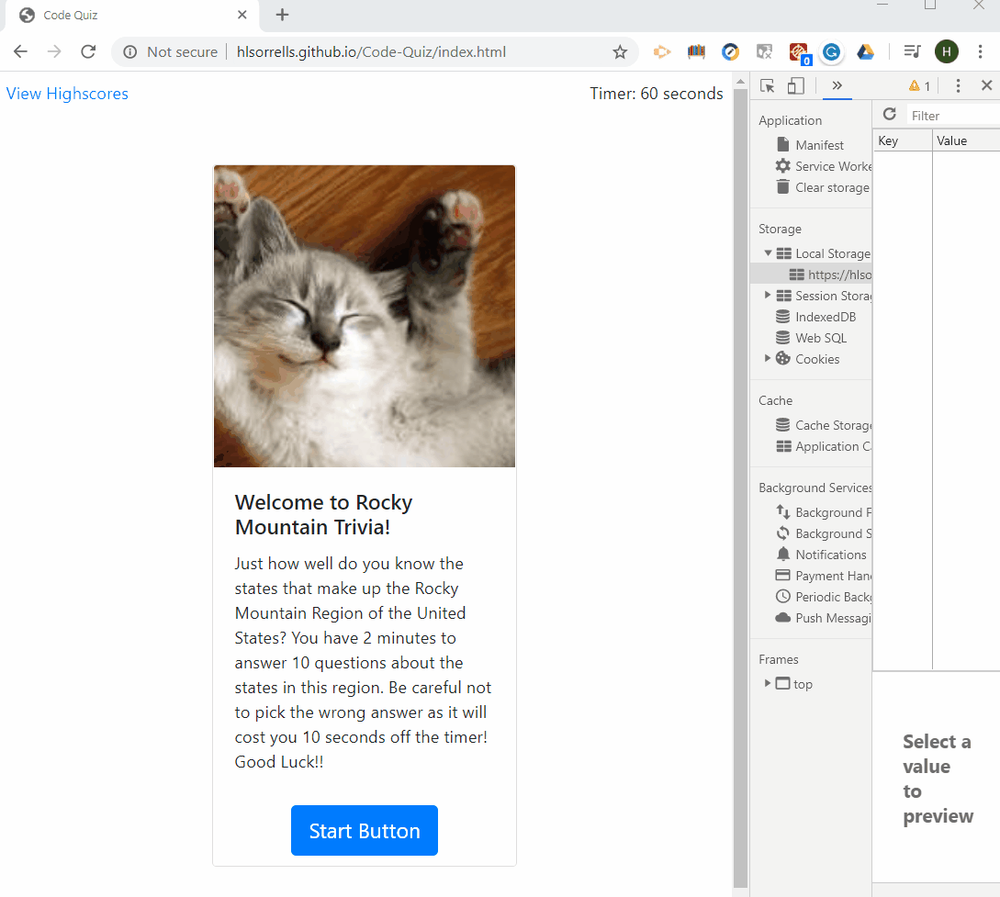

# Code Quiz

## Description 
This app is a timed quiz composed of multiple-choice questions about the Rocky Mountain states. It runs in the browser and features dynamically updated HTML and CSS powered by JavaScript in addition to being responsive to screen size.

## Deployment

  [Code Quiz](https://hlsorrells.github.io/Code-Quiz/index.html)

  

## Table of Contents

  * [User Story](#user-story)
  * [Acceptance Criteria](#acceptance-criteria)
  * [Project Lessons](#project-lessons)
    * [Initial Logic](#initial-logic)
    * [Building Blocks](#building-blocks)
    * [Game Function](#game-function)
    * [Local Storage](#local-storage)
    * [Future Improvements](#future-improvements)
  * [Authors](#author)


## User Story

```
AS A user interested in Rocky Mountain trivia questions
I WANT to take a timed trivia quiz about the Rocky Mountain states
SO THAT I can see how my knowledge of Rocky Mountain states compares to my friends
```

## Acceptance Criteria

```
GIVEN I am taking a trivia quiz
WHEN I click the start button
THEN a timer starts and I am presented with a question
WHEN I answer a question
THEN I am presented with another question
WHEN I answer a question incorrectly
THEN time is subtracted from the clock
WHEN all questions are answered or the timer reaches 0
THEN the game is over
WHEN the game is over
THEN I can save my initials and score
```

## Project Lessons
<details>
    <summary markdown="span">Project Lessons Details</summary>

### Initial Logic
My first thing to tackle was building an HTML layout using bootstrap. I selected a card layout that included an image, card title, and card text. From there, I added two divs for buttons: one was for the vertical answer buttons to be appended to from the JS, the other was for the start button that would be hidden once clicked.

### Building Blocks
I created some "legos" to play with in the JS file by creating global variables for the image, card title, card text, button group, and start button. Also, I knew that I would need a variable to keep count on the timer and another for cycling through the question bank. Then I created my array of questions that could be accessed as objects by my game function.

### Game Function
After created my event listener for the start button, I started working on the game play function. This took some time as I had to logic out each piece of the game from creating the answer buttons, setting the content of each game card, to grading the cards and adjusting the timer for wrong answers. I learned a valuable lesson during this project, do not put a function inside of another function when I am still learning JavaScript. Originally, I nested the function displayGrade inside of the function game. This caused my question cycle to skip the third question going straight from the second question to the fourth question.

### Local Storage
This project challenged me to set the local storage while the user was on the results page before transitioning to the leaderboard page. This meant that the user data had to be capture on submit to save to local storage, then retrieved from local storage to build the leaderboard.

### Future Improvements
As I did not have the time to fully complete this project, I would like to revisit this application later as I think it could be turned into a very fun game for me and my nephew to play. This application could provide him with a simple game to use like flashcards for his school studies. I hope to expand on this idea as I learn more about building web applications.
</details>

## Screenshots
<details>
    <summary markdown="span">Project Lessons Details</summary>


*Home Page of Game*


*Trivia Question Page*


*Game Results Page*


*Leaderboard Page with Game Results*


</details>

## Author
[Heather Sorrells](mailto:hlsorrells.dev@gmail.com)
